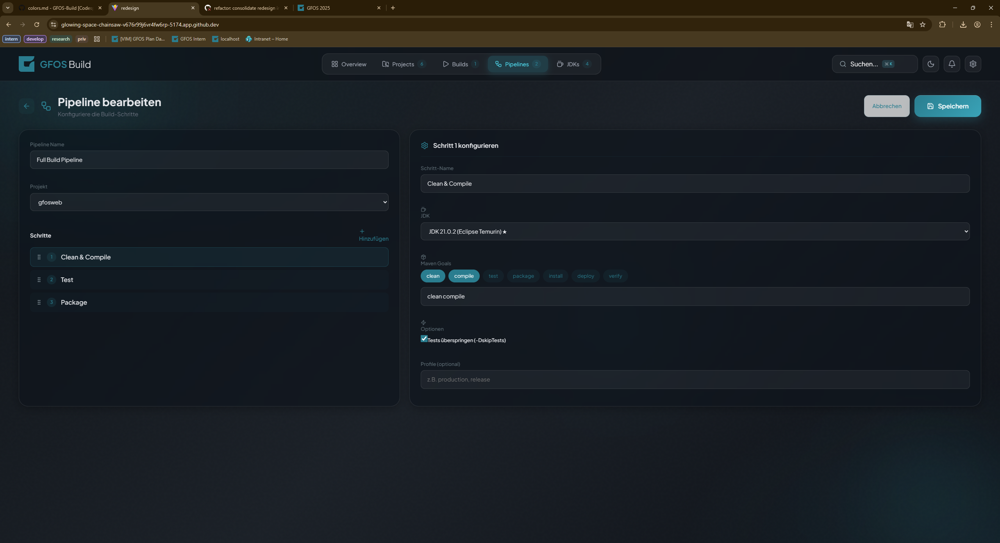

[data-theme="light"] {
  /* color */
  --accent-highlight: var(--color-light-200);
  --accent-highlight-primary: var(--brand-clear-petrol-50);
  --accent-hover: var(--color-light-300);
  --accent-matchcode-button: var(--color-dark-300);
  --accent-primary: var(--brand-clear-petrol-500);
  --accent-primary-disabled: var(--color-dark-100);
  --accent-secondary: var(--brand-clear-petrol-700);
  --border-default: var(--color-light-400);
  --border-designer: var(--brand-designer-100);
  --border-error: var(--color-error-100);
  --border-info: var(--color-info-100);
  --border-intense: var(--color-light-600);
  --border-primary: var(--brand-clear-petrol-100);
  --border-success: var(--color-success-100);
  --border-warning: var(--color-warning-100);
  --defaults-black: #000000;
  --defaults-primary: var(--brand-clear-petrol-500);
  --defaults-secondary: var(--brand-clear-petrol-700);
  --defaults-transparent: #ffffff00;
  --defaults-white: #ffffff;
  --surface-component: #9747ff;
  --surface-bg: var(--color-light-50);
  --surface-bg-app: var(--white);
  --surface-bg-designer: var(--brand-designer-50);
  --surface-bg-disabled: var(--color-light-200);
  --surface-bg-disabled-light: var(--color-light-100);
  --surface-bg-error: var(--color-error-50);
  --surface-bg-info: var(--color-info-50);
  --surface-bg-panel: var(--color-light-100);
  --surface-bg-primary: var(--brand-clear-petrol-50);
  --surface-bg-primary-full: var(--brand-clear-petrol-500);
  --surface-bg-success: var(--color-success-50);
  --surface-bg-table-header: var(--color-light-200);
  --surface-bg-warning: var(--color-warning-50);
  --table-alternating-line-bg: var(--color-light-100);
  --table-level-1: var(--color-light-300);
  --table-level-2: var(--color-light-200);
  --text-designer: var(--brand-designer-500);
  --text-disabled: var(--color-dark-100);
  --text-disabled-intense: var(--color-dark-400);
  --text-disabled-inverted: var(--color-dark-100);
  --text-disabled-inverted-intense: var(--color-dark-200);
  --text-error: var(--color-error-500);
  --text-info: var(--color-info-500);
  --text-primary: var(--color-dark-500);
  --text-primary-colored: var(--brand-clear-petrol-500);
  --text-primary-inverted: var(--white);
  --text-secondary: var(--color-dark-300);
  --text-secondary-colored: var(--brand-clear-petrol-300);
  --text-secondary-inverted: var(--color-light-500);
  --text-success: var(--color-success-700);
  --text-warning: var(--color-warning-600);
  --utility-clear-petrol-100: var(--brand-clear-petrol-100);
  --utility-clear-petrol-200: var(--brand-clear-petrol-200);
  --utility-clear-petrol-300: var(--brand-clear-petrol-300);
  --utility-clear-petrol-400: var(--brand-clear-petrol-400);
  --utility-clear-petrol-50: var(--brand-clear-petrol-50);
  --utility-clear-petrol-500: var(--brand-clear-petrol-500);
  --utility-clear-petrol-600: var(--brand-clear-petrol-600);
  --utility-clear-petrol-700: var(--brand-clear-petrol-700);
  --utility-clear-petrol-800: var(--brand-clear-petrol-800);
  --utility-clear-petrol-900: var(--brand-clear-petrol-900);
  --utility-designer-100: var(--brand-designer-100);
  --utility-designer-200: var(--brand-designer-200);
  --utility-designer-300: var(--brand-designer-300);
  --utility-designer-400: var(--brand-designer-400);
  --utility-designer-50: var(--brand-designer-50);
  --utility-designer-500: var(--brand-designer-500);
  --utility-designer-600: var(--brand-designer-600);
  --utility-designer-700: var(--brand-designer-700);
  --utility-designer-800: var(--brand-designer-800);
  --utility-designer-900: var(--brand-designer-900);
  --utility-dynamic-red-100: var(--brand-dynamic-red-100);
  --utility-dynamic-red-200: var(--brand-dynamic-red-200);
  --utility-dynamic-red-300: var(--brand-dynamic-red-300);
  --utility-dynamic-red-400: var(--brand-dynamic-red-400);
  --utility-dynamic-red-50: var(--brand-dynamic-red-50);
  --utility-dynamic-red-500: var(--brand-dynamic-red-500);
  --utility-dynamic-red-600: var(--brand-dynamic-red-600);
  --utility-dynamic-red-700: var(--brand-dynamic-red-700);
  --utility-dynamic-red-800: var(--brand-dynamic-red-800);
  --utility-dynamic-red-900: var(--brand-dynamic-red-900);
  --utility-error-100: var(--color-error-100);
  --utility-error-200: var(--color-error-200);
  --utility-error-300: var(--color-error-300);
  --utility-error-400: var(--color-error-400);
  --utility-error-50: var(--color-error-50);
  --utility-error-500: var(--color-error-500);
  --utility-error-600: var(--color-error-600);
  --utility-error-700: var(--color-error-700);
  --utility-error-800: var(--color-error-800);
  --utility-error-900: var(--color-error-900);
  --utility-gray-100: var(--brand-cool-gray-100);
  --utility-gray-200: var(--brand-cool-gray-200);
  --utility-gray-300: var(--brand-cool-gray-300);
  --utility-gray-400: var(--brand-cool-gray-400);
  --utility-gray-50: var(--brand-cool-gray-50);
  --utility-gray-500: var(--brand-cool-gray-500);
  --utility-gray-600: var(--brand-cool-gray-600);
  --utility-gray-700: var(--brand-cool-gray-700);
  --utility-gray-800: var(--brand-cool-gray-800);
  --utility-gray-900: var(--brand-cool-gray-900);
  --utility-info-100: var(--color-info-100);
  --utility-info-200: var(--color-info-200);
  --utility-info-300: var(--color-info-300);
  --utility-info-400: var(--color-info-400);
  --utility-info-50: var(--color-info-50);
  --utility-info-500: var(--color-info-500);
  --utility-info-600: var(--color-info-600);
  --utility-info-700: var(--color-info-700);
  --utility-info-800: var(--color-info-800);
  --utility-info-900: var(--color-info-900);
  --utility-orange-100: var(--brand-orange-100);
  --utility-orange-200: var(--brand-orange-200);
  --utility-orange-300: var(--brand-orange-300);
  --utility-orange-400: var(--brand-orange-400);
  --utility-orange-50: var(--brand-orange-50);
  --utility-orange-500: var(--brand-orange-500);
  --utility-orange-600: var(--brand-orange-600);
  --utility-orange-700: var(--brand-orange-700);
  --utility-orange-800: var(--brand-orange-800);
  --utility-orange-900: var(--brand-orange-900);
  --utility-success-100: var(--color-success-100);
  --utility-success-200: var(--color-success-200);
  --utility-success-300: var(--color-success-300);
  --utility-success-400: var(--color-success-400);
  --utility-success-50: var(--color-success-50);
  --utility-success-500: var(--color-success-500);
  --utility-success-600: var(--color-success-600);
  --utility-success-700: var(--color-success-700);
  --utility-success-800: var(--color-success-800);
  --utility-success-900: var(--color-success-900);
  --utility-warning-100: var(--color-warning-100);
  --utility-warning-200: var(--color-warning-200);
  --utility-warning-300: var(--color-warning-300);
  --utility-warning-400: var(--color-warning-400);
  --utility-warning-50: var(--color-warning-50);
  --utility-warning-500: var(--color-warning-500);
  --utility-warning-600: var(--color-warning-600);
  --utility-warning-700: var(--color-warning-700);
  --utility-warning-800: var(--color-warning-800);
  --utility-warning-900: var(--color-warning-900);
}
[data-theme="dark"] {
  /* color */
  --accent-highlight: var(--color-dark-600);
  --accent-highlight-primary: var(--brand-clear-petrol-900);
  --accent-hover: var(--color-dark-700);
  --accent-matchcode-button: var(--color-dark-300);
  --accent-primary: var(--brand-clear-petrol-500);
  --accent-primary-disabled: var(--color-dark-500);
  --accent-secondary: var(--brand-clear-petrol-700);
  --border-default: var(--color-dark-500);
  --border-designer: var(--brand-designer-800);
  --border-error: var(--color-error-800);
  --border-info: var(--color-info-800);
  --border-intense: var(--color-dark-300);
  --border-primary: var(--brand-clear-petrol-800);
  --border-success: var(--color-success-800);
  --border-warning: var(--color-warning-800);
  --defaults-black: #000000;
  --defaults-primary: var(--brand-clear-petrol-500);
  --defaults-secondary: var(--brand-clear-petrol-700);
  --defaults-transparent: #ffffff00;
  --defaults-white: #ffffff;
  --surface-component: #9747ff;
  --surface-bg: var(--color-dark-800);
  --surface-bg-app: var(--color-dark-900);
  --surface-bg-designer: var(--brand-designer-900);
  --surface-bg-disabled: var(--color-dark-600);
  --surface-bg-disabled-light: var(--color-dark-700);
  --surface-bg-error: var(--color-error-900);
  --surface-bg-info: var(--color-info-900);
  --surface-bg-panel: var(--color-dark-600);
  --surface-bg-primary: var(--brand-clear-petrol-900);
  --surface-bg-primary-full: var(--brand-clear-petrol-700);
  --surface-bg-success: var(--color-success-900);
  --surface-bg-table-header: var(--color-dark-600);
  --surface-bg-warning: var(--color-warning-900);
  --table-alternating-line-bg: var(--color-dark-700);
  --table-level-1: var(--color-dark-500);
  --table-level-2: var(--color-dark-600);
  --text-designer: var(--brand-designer-200);
  --text-disabled: var(--color-dark-400);
  --text-disabled-intense: var(--color-dark-200);
  --text-disabled-inverted: var(--color-dark-700);
  --text-disabled-inverted-intense: var(--color-dark-400);
  --text-error: var(--color-error-400);
  --text-info: var(--color-info-400);
  --text-primary: var(--color-light-50);
  --text-primary-colored: var(--brand-clear-petrol-300);
  --text-primary-inverted: var(--color-dark-500);
  --text-secondary: var(--color-dark-300);
  --text-secondary-colored: var(--brand-clear-petrol-600);
  --text-secondary-inverted: var(--color-light-500);
  --text-success: var(--color-success-400);
  --text-warning: var(--color-warning-400);
  --utility-clear-petrol-100: var(--brand-clear-petrol-800);
  --utility-clear-petrol-200: var(--brand-clear-petrol-700);
  --utility-clear-petrol-300: var(--brand-clear-petrol-600);
  --utility-clear-petrol-400: var(--brand-clear-petrol-500);
  --utility-clear-petrol-50: var(--brand-clear-petrol-900);
  --utility-clear-petrol-500: var(--brand-clear-petrol-500);
  --utility-clear-petrol-600: var(--brand-clear-petrol-300);
  --utility-clear-petrol-700: var(--brand-clear-petrol-200);
  --utility-clear-petrol-800: var(--brand-clear-petrol-100);
  --utility-clear-petrol-900: var(--brand-clear-petrol-50);
  --utility-designer-100: var(--brand-designer-800);
  --utility-designer-200: var(--brand-designer-700);
  --utility-designer-300: var(--brand-designer-600);
  --utility-designer-400: var(--brand-designer-500);
  --utility-designer-50: var(--brand-designer-900);
  --utility-designer-500: var(--brand-designer-400);
  --utility-designer-600: var(--brand-designer-300);
  --utility-designer-700: var(--brand-designer-200);
  --utility-designer-800: var(--brand-designer-100);
  --utility-designer-900: var(--brand-designer-50);
  --utility-dynamic-red-100: var(--brand-dynamic-red-800);
  --utility-dynamic-red-200: var(--brand-dynamic-red-700);
  --utility-dynamic-red-300: var(--brand-dynamic-red-600);
  --utility-dynamic-red-400: var(--brand-dynamic-red-500);
  --utility-dynamic-red-50: var(--brand-dynamic-red-900);
  --utility-dynamic-red-500: var(--brand-dynamic-red-400);
  --utility-dynamic-red-600: var(--brand-dynamic-red-300);
  --utility-dynamic-red-700: var(--brand-dynamic-red-200);
  --utility-dynamic-red-800: var(--brand-dynamic-red-100);
  --utility-dynamic-red-900: var(--brand-dynamic-red-50);
  --utility-error-100: var(--color-error-800);
  --utility-error-200: var(--color-error-700);
  --utility-error-300: var(--color-error-600);
  --utility-error-400: var(--color-error-500);
  --utility-error-50: var(--color-error-900);
  --utility-error-500: var(--color-error-500);
  --utility-error-600: var(--color-error-300);
  --utility-error-700: var(--color-error-200);
  --utility-error-800: var(--color-error-100);
  --utility-error-900: var(--color-error-50);
  --utility-gray-100: var(--brand-cool-gray-800);
  --utility-gray-200: var(--brand-cool-gray-700);
  --utility-gray-300: var(--brand-cool-gray-600);
  --utility-gray-400: var(--brand-cool-gray-500);
  --utility-gray-50: var(--brand-cool-gray-900);
  --utility-gray-500: var(--brand-cool-gray-400);
  --utility-gray-600: var(--brand-cool-gray-300);
  --utility-gray-700: var(--brand-cool-gray-200);
  --utility-gray-800: var(--brand-cool-gray-100);
  --utility-gray-900: var(--brand-cool-gray-50);
  --utility-info-100: var(--color-info-800);
  --utility-info-200: var(--color-info-700);
  --utility-info-300: var(--color-info-600);
  --utility-info-400: var(--color-info-500);
  --utility-info-50: var(--color-info-900);
  --utility-info-500: var(--color-info-400);
  --utility-info-600: var(--color-info-300);
  --utility-info-700: var(--color-info-200);
  --utility-info-800: var(--color-info-100);
  --utility-info-900: var(--color-info-50);
  --utility-orange-100: var(--brand-orange-800);
  --utility-orange-200: var(--brand-orange-700);
  --utility-orange-300: var(--brand-orange-600);
  --utility-orange-400: var(--brand-orange-500);
  --utility-orange-50: var(--brand-orange-900);
  --utility-orange-500: var(--brand-orange-500);
  --utility-orange-600: var(--brand-orange-300);
  --utility-orange-700: var(--brand-orange-200);
  --utility-orange-800: var(--brand-orange-100);
  --utility-orange-900: var(--brand-orange-50);
  --utility-success-100: var(--color-success-800);
  --utility-success-200: var(--color-success-700);
  --utility-success-300: var(--color-success-600);
  --utility-success-400: var(--color-success-500);
  --utility-success-50: var(--color-success-900);
  --utility-success-500: var(--color-success-400);
  --utility-success-600: var(--color-success-300);
  --utility-success-700: var(--color-success-200);
  --utility-success-800: var(--color-success-100);
  --utility-success-900: var(--color-success-50);
  --utility-warning-100: var(--color-warning-800);
  --utility-warning-200: var(--color-warning-700);
  --utility-warning-300: var(--color-warning-600);
  --utility-warning-400: var(--color-warning-500);
  --utility-warning-50: var(--color-warning-900);
  --utility-warning-500: var(--color-warning-400);
  --utility-warning-600: var(--color-warning-300);
  --utility-warning-700: var(--color-warning-200);
  --utility-warning-800: var(--color-warning-100);
  --utility-warning-900: var(--color-warning-50);
}
[data-theme="primary-petrol"] {
  /* color */
  --accent-highlight: var(--brand-clear-petrol-600);
  --accent-highlight-primary: var(--brand-clear-petrol-600);
  --accent-hover: var(--brand-clear-petrol-700);
  --accent-matchcode-button: var(--color-light-50);
  --accent-primary: var(--brand-clear-petrol-400);
  --accent-primary-disabled: var(--brand-clear-petrol-300);
  --accent-secondary: var(--brand-clear-petrol-700);
  --border-default: var(--brand-clear-petrol-400);
  --border-designer: var(--brand-designer-300);
  --border-error: var(--color-error-600);
  --border-info: var(--color-info-300);
  --border-intense: var(--brand-clear-petrol-300);
  --border-primary: var(--brand-clear-petrol-300);
  --border-success: var(--color-success-300);
  --border-warning: var(--color-warning-300);
  --defaults-black: #000000;
  --defaults-primary: var(--brand-clear-petrol-500);
  --defaults-secondary: var(--brand-clear-petrol-700);
  --defaults-transparent: #ffffff00;
  --defaults-white: #ffffff;
  --surface-component: #9747ff;
  --surface-bg: var(--brand-clear-petrol-500);
  --surface-bg-app: var(--brand-clear-petrol-500);
  --surface-bg-designer: var(--brand-designer-900);
  --surface-bg-disabled: var(--brand-clear-petrol-600);
  --surface-bg-disabled-light: var(--brand-clear-petrol-700);
  --surface-bg-error: var(--color-error-700);
  --surface-bg-info: var(--color-info-50);
  --surface-bg-panel: var(--brand-clear-petrol-600);
  --surface-bg-primary: var(--brand-clear-petrol-900);
  --surface-bg-primary-full: var(--brand-clear-petrol-500);
  --surface-bg-success: var(--color-success-900);
  --surface-bg-table-header: var(--brand-clear-petrol-600);
  --surface-bg-warning: var(--color-warning-900);
  --table-alternating-line-bg: var(--brand-clear-petrol-400);
  --table-level-1: var(--brand-clear-petrol-700);
  --table-level-2: var(--brand-clear-petrol-600);
  --text-designer: var(--brand-designer-500);
  --text-disabled: var(--brand-clear-petrol-300);
  --text-disabled-intense: var(--brand-clear-petrol-200);
  --text-disabled-inverted: var(--color-dark-700);
  --text-disabled-inverted-intense: var(--color-dark-400);
  --text-error: var(--color-error-200);
  --text-info: var(--color-info-200);
  --text-primary: var(--color-light-50);
  --text-primary-colored: var(--color-light-50);
  --text-primary-inverted: var(--color-dark-500);
  --text-secondary: var(--brand-clear-petrol-100);
  --text-secondary-colored: var(--brand-clear-petrol-100);
  --text-secondary-inverted: var(--color-light-500);
  --text-success: var(--color-success-400);
  --text-warning: var(--color-warning-500);
  --utility-clear-petrol-100: var(--brand-clear-petrol-800);
  --utility-clear-petrol-200: var(--brand-clear-petrol-700);
  --utility-clear-petrol-300: var(--brand-clear-petrol-600);
  --utility-clear-petrol-400: var(--brand-clear-petrol-500);
  --utility-clear-petrol-50: var(--brand-clear-petrol-900);
  --utility-clear-petrol-500: var(--brand-clear-petrol-500);
  --utility-clear-petrol-600: var(--brand-clear-petrol-300);
  --utility-clear-petrol-700: var(--brand-clear-petrol-200);
  --utility-clear-petrol-800: var(--brand-clear-petrol-100);
  --utility-clear-petrol-900: var(--brand-clear-petrol-50);
  --utility-designer-100: var(--brand-designer-800);
  --utility-designer-200: var(--brand-designer-700);
  --utility-designer-300: var(--brand-designer-600);
  --utility-designer-400: var(--brand-designer-500);
  --utility-designer-50: var(--brand-designer-900);
  --utility-designer-500: var(--brand-designer-400);
  --utility-designer-600: var(--brand-designer-300);
  --utility-designer-700: var(--brand-designer-200);
  --utility-designer-800: var(--brand-designer-100);
  --utility-designer-900: var(--brand-designer-50);
  --utility-dynamic-red-100: var(--brand-dynamic-red-800);
  --utility-dynamic-red-200: var(--brand-dynamic-red-700);
  --utility-dynamic-red-300: var(--brand-dynamic-red-600);
  --utility-dynamic-red-400: var(--brand-dynamic-red-500);
  --utility-dynamic-red-50: var(--brand-dynamic-red-900);
  --utility-dynamic-red-500: var(--brand-dynamic-red-400);
  --utility-dynamic-red-600: var(--brand-dynamic-red-300);
  --utility-dynamic-red-700: var(--brand-dynamic-red-200);
  --utility-dynamic-red-800: var(--brand-dynamic-red-100);
  --utility-dynamic-red-900: var(--brand-dynamic-red-50);
  --utility-error-100: var(--color-error-800);
  --utility-error-200: var(--color-error-700);
  --utility-error-300: var(--color-error-600);
  --utility-error-400: var(--color-error-500);
  --utility-error-50: var(--color-error-900);
  --utility-error-500: var(--color-error-500);
  --utility-error-600: var(--color-error-300);
  --utility-error-700: var(--color-error-200);
  --utility-error-800: var(--color-error-100);
  --utility-error-900: var(--color-error-50);
  --utility-gray-100: var(--brand-cool-gray-800);
  --utility-gray-200: var(--brand-cool-gray-700);
  --utility-gray-300: var(--brand-cool-gray-600);
  --utility-gray-400: var(--brand-cool-gray-500);
  --utility-gray-50: var(--brand-cool-gray-900);
  --utility-gray-500: var(--brand-cool-gray-400);
  --utility-gray-600: var(--brand-cool-gray-300);
  --utility-gray-700: var(--brand-cool-gray-200);
  --utility-gray-800: var(--brand-cool-gray-100);
  --utility-gray-900: var(--brand-cool-gray-50);
  --utility-info-100: var(--color-info-800);
  --utility-info-200: var(--color-info-700);
  --utility-info-300: var(--color-info-600);
  --utility-info-400: var(--color-info-500);
  --utility-info-50: var(--color-info-900);
  --utility-info-500: var(--color-info-400);
  --utility-info-600: var(--color-info-300);
  --utility-info-700: var(--color-info-200);
  --utility-info-800: var(--color-info-100);
  --utility-info-900: var(--color-info-50);
  --utility-orange-100: var(--brand-orange-800);
  --utility-orange-200: var(--brand-orange-700);
  --utility-orange-300: var(--brand-orange-600);
  --utility-orange-400: var(--brand-orange-500);
  --utility-orange-50: var(--brand-orange-900);
  --utility-orange-500: var(--brand-orange-500);
  --utility-orange-600: var(--brand-orange-300);
  --utility-orange-700: var(--brand-orange-200);
  --utility-orange-800: var(--brand-orange-100);
  --utility-orange-900: var(--brand-orange-50);
  --utility-success-100: var(--color-success-800);
  --utility-success-200: var(--color-success-700);
  --utility-success-300: var(--color-success-600);
  --utility-success-400: var(--color-success-500);
  --utility-success-50: var(--color-success-900);
  --utility-success-500: var(--color-success-400);
  --utility-success-600: var(--color-success-300);
  --utility-success-700: var(--color-success-200);
  --utility-success-800: var(--color-success-100);
  --utility-success-900: var(--color-success-50);
  --utility-warning-100: var(--color-warning-800);
  --utility-warning-200: var(--color-warning-700);
  --utility-warning-300: var(--color-warning-600);
  --utility-warning-400: var(--color-warning-500);
  --utility-warning-50: var(--color-warning-900);
  --utility-warning-500: var(--color-warning-400);
  --utility-warning-600: var(--color-warning-300);
  --utility-warning-700: var(--color-warning-200);
  --utility-warning-800: var(--color-warning-100);
  --utility-warning-900: var(--color-warning-50);
}

:root {
  /* color */
  --black: #000000;
  --primary: var(--brand-clear-petrol-500);
  --secondary: var(--brand-clear-petrol-700);
  --transparent: #ffffff00;
  --white: #ffffff;
  --brand-clear-petrol-100: #b0d7dc;
  --brand-clear-petrol-200: #8ac3cb;
  --brand-clear-petrol-300: #54a8b4;
  --brand-clear-petrol-400: #3397a5;
  --brand-clear-petrol-50: #e6f2f4;
  --brand-clear-petrol-500: #007d8f;
  --brand-clear-petrol-600: #007282;
  --brand-clear-petrol-700: #005966;
  --brand-clear-petrol-800: #00454f;
  --brand-clear-petrol-900: #00353c;
  --brand-cool-gray-100: #c7c7c6;
  --brand-cool-gray-200: #ababab;
  --brand-cool-gray-300: #858584;
  --brand-cool-gray-400: #6d6d6d;
  --brand-cool-gray-50: #ededed;
  --brand-cool-gray-500: #494948;
  --brand-cool-gray-600: #424242;
  --brand-cool-gray-700: #343433;
  --brand-cool-gray-800: #282828;
  --brand-cool-gray-900: #1f1f1e;
  --brand-designer-100: #cec2e0;
  --brand-designer-200: #b6a4d1;
  --brand-designer-300: #957abd;
  --brand-designer-400: #8161b0;
  --brand-designer-50: #efebf5;
  --brand-designer-500: #61399c;
  --brand-designer-600: #58348e;
  --brand-designer-700: #45286f;
  --brand-designer-800: #351f56;
  --brand-designer-900: #291842;
  --brand-dynamic-red-100: #ecb0b8;
  --brand-dynamic-red-200: #e38a95;
  --brand-dynamic-red-300: #d65465;
  --brand-dynamic-red-400: #ce3347;
  --brand-dynamic-red-50: #f9e6e8;
  --brand-dynamic-red-500: #c20019;
  --brand-dynamic-red-600: #b10017;
  --brand-dynamic-red-700: #8a0012;
  --brand-dynamic-red-800: #6b000e;
  --brand-dynamic-red-900: #51000b;
  --brand-legacy-red-100: #f4b0c9;
  --brand-legacy-red-200: #ef8aaf;
  --brand-legacy-red-300: #e8548a;
  --brand-legacy-red-400: #e43374;
  --brand-legacy-red-50: #fce6ee;
  --brand-legacy-red-500: #dd0051;
  --brand-legacy-red-600: #c9004a;
  --brand-legacy-red-700: #9d003a;
  --brand-legacy-red-800: #7a002d;
  --brand-legacy-red-900: #5d0022;
  --brand-orange-100: #fad0ba;
  --brand-orange-200: #f8ba98;
  --brand-orange-300: #f49a6a;
  --brand-orange-400: #f2864d;
  --brand-orange-50: #fdf0e9;
  --brand-orange-500: #ef6820;
  --brand-orange-600: #d95f1d;
  --brand-orange-700: #aa4a17;
  --brand-orange-800: #833912;
  --brand-orange-900: #642c0d;
  --color-dark-100: #c3c3c6;
  --color-dark-200: #a6a7aa;
  --color-dark-300: #7d7e84;
  --color-dark-400: #64656c;
  --color-dark-50: #ececed;
  --color-dark-500: #3d3f47;
  --color-dark-600: #383941;
  --color-dark-700: #2b2d32;
  --color-dark-800: #222327;
  --color-dark-900: #1a1a1e;
  --color-error-100: #ecc9c9;
  --color-error-200: #e3afaf;
  --color-error-300: #d78a8a;
  --color-error-400: #cf7474;
  --color-error-50: #f9eeee;
  --color-error-500: #c35151;
  --color-error-600: #b14a4a;
  --color-error-700: #8a3a3a;
  --color-error-800: #6b2d2d;
  --color-error-900: #522222;
  --color-info-100: #bdd8e9;
  --color-info-200: #9dc5df;
  --color-info-300: #70aad0;
  --color-info-400: #5499c7;
  --color-info-50: #eaf2f8;
  --color-info-500: #2980b9;
  --color-info-600: #2574a8;
  --color-info-700: #1d5b83;
  --color-info-800: #174666;
  --color-info-900: #11364e;
  --color-light-100: #f7f7f7;
  --color-light-200: #f4f4f4;
  --color-light-300: #eeeeee;
  --color-light-400: #ebebeb;
  --color-light-50: #ffffff;
  --color-light-500: #e6e6e6;
  --color-light-600: #d1d1d1;
  --color-light-700: #a3a3a3;
  --color-light-800: #7f7f7f;
  --color-light-900: #616161;
  --color-success-100: #c9ecd8;
  --color-success-200: #afe3c5;
  --color-success-300: #8ad7aa;
  --color-success-400: #74cf99;
  --color-success-50: #e5feee;
  --color-success-500: #51c380;
  --color-success-600: #4ab174;
  --color-success-700: #3a8a5b;
  --color-success-800: #2d6b46;
  --color-success-900: #225236;
  --color-warning-100: #f9dcb0;
  --color-warning-200: #f7cb8a;
  --color-warning-300: #f3b354;
  --color-warning-400: #f1a533;
  --color-warning-50: #fdf4e6;
  --color-warning-500: #ed8e00;
  --color-warning-600: #d88100;
  --color-warning-700: #a86500;
  --color-warning-800: #824e00;
  --color-warning-900: #643c00;